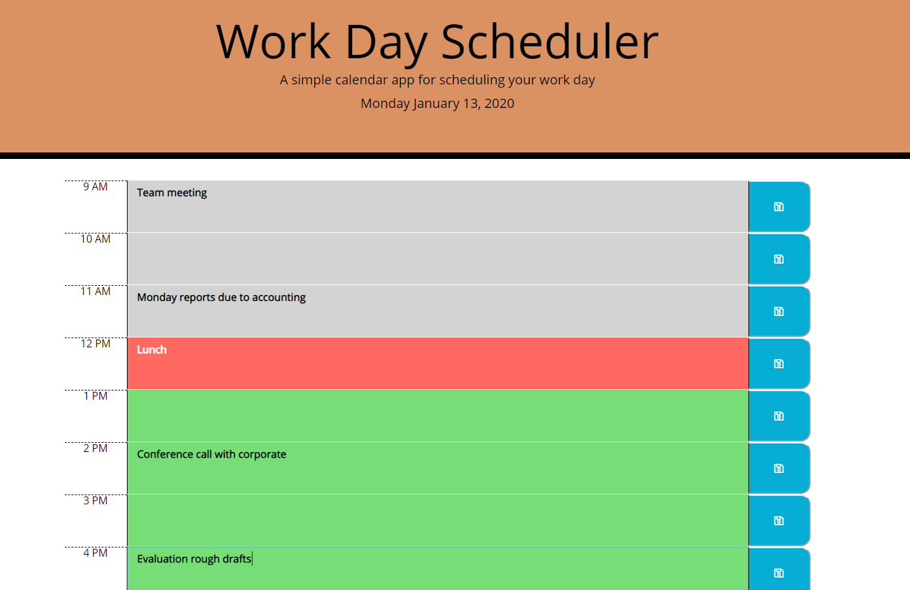

Work Day Scheduler

This app utilizes "Moment" and "Bootstrap" to deliver a daily planner. The app keeps track of the time and changes each hour-row's color based on whether the time has passed, is current, or is upcoming. Entries can be saved using the save buttons to the side which is then saved in the browsers local storage so that users can close out and return back to their planner at any time.
User opens page and there is a header that states it's a planner and has teh current day and date

